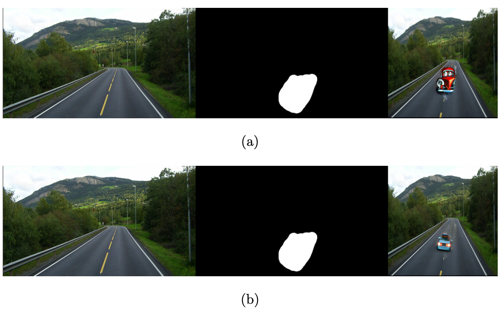

  

Our project addresses limitations in generative modeling by fine-tuning Diffusion Probabilistic Models (DDPMs) and Latent Diffusion Models (LDMs) for generating cartoon or historic images and developing lightweight variants for local deployment. We overcome data coverage is- sues by fine-tuning DDPMs, enabling them to generate coherent images in previously unexplored domains
