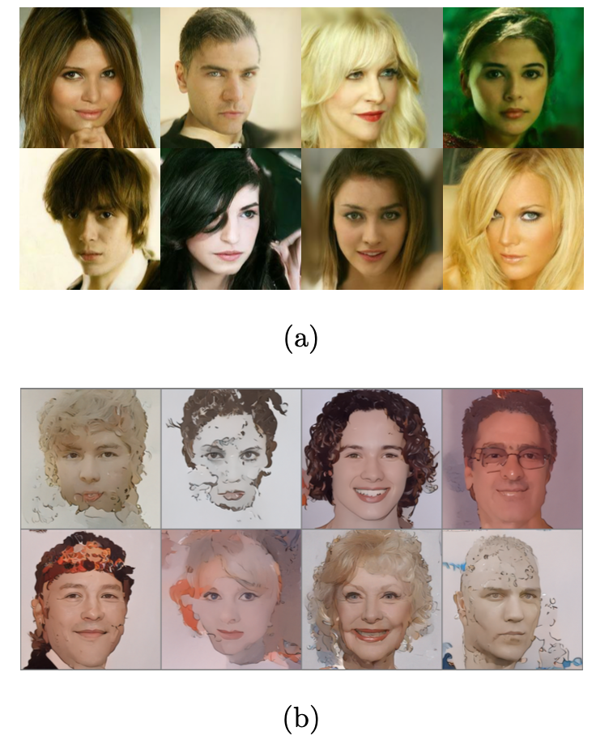

This project addresses limitations in generative modeling by fine-tuning Diffusion Probabilistic Models (DDPMs) and Latent Diffusion Models (LDMs) for generating cartoon or historic images and developing lightweight variants for local deployment. We overcome data coverage issues by fine-tuning DDPMs, enabling them to generate coherent images in previously unexplored domains

  
Comparative analysis of images generated from (a) Stable Diffusions, (b) Cartoon caption fine-tuned Stable Diffusion, and (c) Historic images fine-tuned Stable Diffusion.

Comparison between results given by (a) Fine-Tuned Stable Diffusion on performing in- painting through prompt:’a <cmg >cartoon car’, where <cmg >is the unique token representing the cartoon style and cartoon is the class prompt vs (b) Stable diffusion with prompt:’a car’.

Comparison between sampled results generated by (a) google-celeba-hq and (b) google- celeba-finetuned-cartoonfaces fine-tuned on cartoon faces dataset

